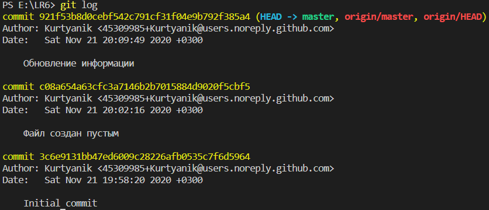

# **LR6**

## Лабораторная работа №6
## Система контроля версий

**Цель лабораторной работы:**
изучение базовых возможностей системы управления версиями, опыт работы с Git Api, опыт работы с локальным и удаленным репозиторием.

------------

## Ход работы
1. Создаётся аккаунт на сайте GitHub

    
2. Была сделана копия репозитория https://github.com/Kurtyanik/LR6/ в личное хранилище (fork).

    
3. Устанавливается Git.
    
    
4. Настройка клиента Git, вводится имя пользователя и email.

    ```console
    git config --global user.name "4118 Кужлев А.А."
    git config --global user.email "kuzhlev.artem@mail.ru"
    ```
    
5. Личный удалённый репозиторий клонируется на компьютер.

    ```console
    git clone https://github.com/catopes22/LR6.git
    ```
    
6. Был добавлен текстовый файл task6.txt в репозиторий через интерфейс GitHub, затем изменения были подтянуты в локальный репозиторий.

    
    ```console
    git branch
    git pull
    ```
    
    
7. Была получена история операций для каждой из веток.

    ```console
    git log
    ```
    
    ```console
    git checkout branch1
    git log
    ```
    
8. Были просмотрены последние изменения.

    ```console
    git status
    ```
    
    
9.  Было выполнено слияние в ветку master с разрешением конфликтов при помощи графического интерфейса Visual Studio Code.

    ```console
    git merge branch1
    ```
    
    ```console
    git add mergefile.txt
    git commit -m "merged master fixed conflict"
    ```
    
    
    
    
10. Удаляется побочная ветка.

    ```console
    git branch -d branch1
    ```
    
11. Были сделаны и зафиксированы изменения c 3 комментариями.

    ```console
    git add .
    git commit -m "feat: add greetings SUAI"
    ```
    

    ```console
    git add .
    git commit -m "feat: add hello 4118"
    ```
    

     ```console
    git add .
    git commit -m "feat: add equation"
    ```
    

    Вид файла task6.txt:

    
12. Был сделан откат коммита.

    Коммит, который будет удалён:
    

    ```console
    git reset --hard HEAD~
    ```
    

    Файл task6.txt после отката:

    
13. Была создана ветка report для отчёта.

    ```console
    git branch
    git branch report
    ```
    
14. Была получена история операций в форматированном виде *(сокращённый хэш | дата коммитера | имя автора: комментарий)*.

    ```console
    git log --pretty=format:"%h | %cd | %an: %s"
    ```
    
 
--------

## Вывод: 
В ходе данной лабораторной работы были изучены базовые возможности системы управления версиями, был получен опыт работы с Git Api и с локальным и удаленным репозиторием.